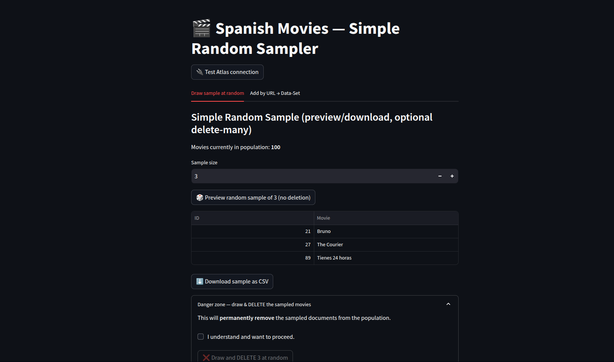
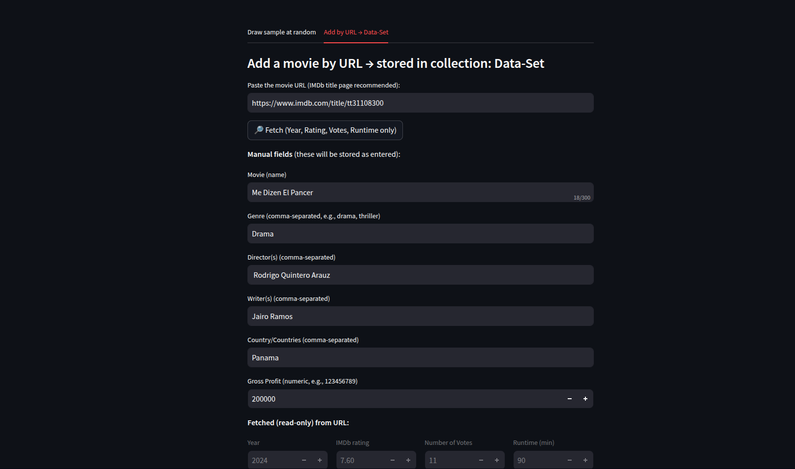

# MOVIE-SAMPLER 🎬  
_Discover • Sample • Curate Spanish movies with Streamlit + MongoDB Atlas_


> A Streamlit app for **simple random sampling** of a movie population, **deleting** selected items, and **building a dataset** by pasting an **IMDb URL** (auto-fetching Year, IMDb Rating, Votes, Runtime) plus **manual fields** for the rest. Uses a `.env` for credentials and secure TLS via `certifi`.

---

## Table of Contents
- [Demo](#demo)
- [Features](#features)
- [Architecture](#architecture)
- [Data Model](#data-model)
- [Quickstart](#quickstart)
- [Configuration](#configuration)
- [Run](#run)
- [Troubleshooting](#troubleshooting)
- [Common Tasks](#common-tasks)
- [Roadmap](#roadmap)
- [Contributing](#contributing)
- [License](#license)

---

## Demo
> _Screenshots/recordings (optional). Replace the placeholders below with real images from your repo._

| Random Sample | Add by URL |
|---|---|
|  |  |

---

## Features

- **Population management** (`Movie-List.Population`)
  - View titles, **search**, and **delete** a single movie.
  - “Refresh” picks a **random** movie from the filtered list.
  - Draw **simple random samples** (e.g., 250) using MongoDB’s `$sample`.
  - Optionally **delete** the sampled set from the population.

- **Dataset building** (`Movie-List.Data-Set`)
  - Paste an **IMDb title URL**.
  - Auto-fetch **Year**, **IMDb rating**, **Number of votes**, **Runtime (minutes)**.
  - Manually enter: **Movie**, **Genre(s)**, **Director(s)**, **Writer(s)**, **Country(ies)**, **Gross Profit**.
  - **Budget is intentionally excluded**.
  - **Upsert** by URL (or by Movie+Year if URL omitted).

- **Secure configuration**
  - Credentials in **`.env`** (git-ignored).
  - TLS via **`certifi`** CA bundle.
  - Optional connection **ping** button for quick diagnostics.

---

## Architecture

```
Streamlit UI (app.py)
  ├─ Tab 1: SRS Sample  ──> MongoDB {Movie-List.Population} ($sample, delete_many)
  └─ Tab 2: Add by URL ──> IMDb (requests + BeautifulSoup)
                          └─ MongoDB {Movie-List.Data-Set} (upsert)
```

- **Language:** Python 3.12  
- **Libs:** `streamlit`, `pymongo[srv]`, `requests`, `beautifulsoup4`, `pandas`, `python-dotenv`, `certifi`  
- **DB:** MongoDB Atlas (SRV URI)

---

## Data Model

### Population collection: `Movie-List.Population`
```json
{ "ID": 123, "Movie": "El último viaje" }
```

> Tip: create a **unique index** on `"ID"` to make single deletes reliable:
```js
db.getSiblingDB("Movie-List").Population.createIndex({ ID: 1 }, { unique: true })
```

### Dataset collection: `Movie-List.Data-Set`
```json
{
  "URL": "https://www.imdb.com/title/tt1234567/",
  "Movie": "Some Title",
  "Genre": ["drama", "thriller"],
  "Year": 2024,
  "IMDb rating": 6.8,
  "Director": ["First Last"],
  "Number of Votes": 1234,
  "Writer": ["Another Person"],
  "Country": ["Spain"],
  "Runtime": 120,
  "Gross Profit": 123456789
}
```

---

## Quickstart

```bash
# 1) Clone
git clone https://github.com/<you>/movie-sampler.git
cd movie-sampler

# 2) Create env (conda or venv; conda shown)
conda create -n movie312 python=3.12 -y
conda activate movie312

# 3) Install deps
pip install -r requirements.txt

# 4) Create .env (see below) and ensure your Atlas IP is allow-listed
cp .env.example .env  # or create manually

# 5) Run
streamlit run app.py
```

---

## Configuration

Create **`.env`** in the project root:

```env
MONGO_URI="mongodb+srv://<user>:<pass>@<cluster>.mongodb.net/?retryWrites=true&w=majority"
DB_NAME="Movie-List"
COLLECTION_NAME="Population"
```

> Keep `.env` out of git. The provided `.gitignore` already ignores it.

---

## Run

```bash
# optional: clear proxies that may break TLS/DNS
unset HTTPS_PROXY https_proxy HTTP_PROXY http_proxy
export NO_PROXY=".mongodb.net,.mongodb.com,localhost,127.0.0.1"

# start the app
streamlit run app.py
```

Open the URL Streamlit prints (e.g., `http://localhost:8501`).

---

## Troubleshooting

<details>
<summary><b>ServerSelectionTimeoutError / TLS handshake failed</b></summary>

1. **Allowlist IP** in Atlas → Network Access. For a quick test, allow `0.0.0.0/0` (then restrict).  
2. Ensure SRV + CA deps in the **same env**:
   ```bash
   pip install --upgrade "pymongo[srv]>=4.7.2" dnspython certifi
   conda install -y openssl ca-certificates certifi
   python -c "import ssl; print(ssl.OPENSSL_VERSION)"  # TLS 1.2+ required
   ```
3. **Disable proxies / SSL inspection** temporarily (or try a mobile hotspot):
   ```bash
   unset HTTPS_PROXY https_proxy HTTP_PROXY http_proxy
   export NO_PROXY=".mongodb.net,.mongodb.com,localhost,127.0.0.1"
   ```
4. Copy a **fresh SRV URI** from Atlas (Drivers → “Connect your application”).  
5. Try the **non-SRV** connection string from Atlas if DNS is blocked.  
6. In the app, click **🔌 Test Atlas connection** to verify.
</details>

<details>
<summary><b>Random selection always picks first item</b></summary>
We persist `selected_id` in `st.session_state` and pick a random ID when there’s no valid selection (or on “Refresh”). If you still see the first item, ensure you’re on the latest `app.py` in this repo.
</details>

---

## Common Tasks

### Seed population from CSV (optional helper)
If you want a CLI seeder, add a small script like:

```python
# seed_from_csv.py
import os, pandas as pd
from pymongo import MongoClient
from dotenv import load_dotenv; load_dotenv()
client = MongoClient(os.getenv("MONGO_URI"), tls=True)
col = client[os.getenv("DB_NAME", "Movie-List")][os.getenv("COLLECTION_NAME", "Population")]
col.create_index("ID", unique=True)
df = pd.read_csv("Movie-Grid view.csv")
docs = df[["ID","Movie"]].to_dict("records")
col.insert_many(docs, ordered=False)
print(f"Seeded {len(docs)} docs")
```

Run:
```bash
python seed_from_csv.py
```

### Draw a sample without deleting
Use the **“Preview random sample”** button in Tab 2; download the CSV.

---

## Roadmap
- [ ] “Soft delete” mode (mark selected instead of removing)  
- [ ] Row selection via `st.data_editor`  
- [ ] Optional export of selected dataset to CSV/Parquet  
- [ ] Secondary source parser (e.g., Wikipedia) for Country/Directors  
- [ ] Dockerfile for containerized deploy  

---

## Contributing
PRs welcome! Please open an issue first for major changes.  
Make sure secrets are not committed (keep using `.env`).

---

## License
MIT © 2025 Navodhya Fernando

---

### Suggested GitHub “Topics”
`streamlit` · `python` · `mongodb` · `atlas` · `imdb` · `web-scraping` · `movies` · `data-collection` · `random-sampling`
